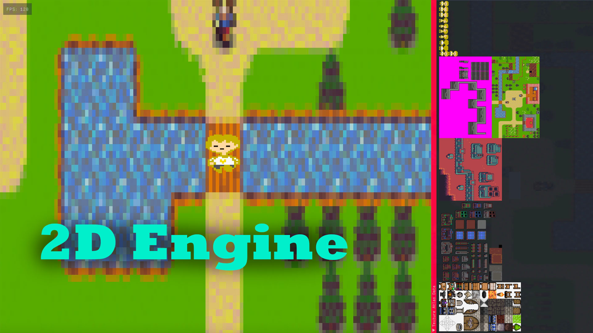
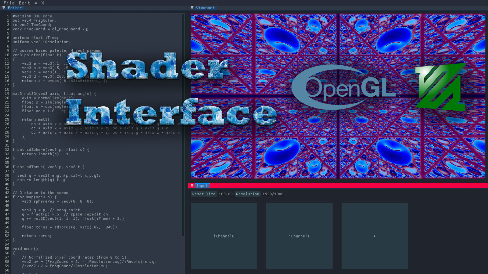
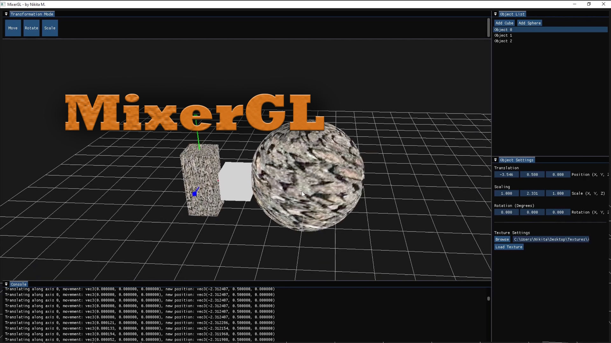

# About Me

Hi! I’m a Computer Science student at Florida International University.  
I’m passionate about computer graphics—especially OpenGL—and I enjoy building tools for real-time rendering, shaders, and small game engines. I like clean, readable code and simple UI that helps you focus on making things.

**What I’m into right now**
- OpenGL / real-time rendering and shader art
- C++ engines with GLFW/GLAD and ImGui tools
- Texture atlases, rect packing, and performance basics
- Cross-platform builds (Windows, macOS, Linux)

---

# My Projects

## [2D Engine](https://github.com/MuzychenkoNikita/2D-Engine)

An open-source library that simplifies 2D game development on OpenGL.  
The repository is split into the core library and an example game that shows how to use the API to build a real project.

**Highlights**
- Texture atlas with a rectangle packing algorithm for fewer binds and better performance  
- Clear API for sprites, animations, and levels  
- Cross-platform: Windows, macOS, Linux  

**Next steps**
- Scripting support for levels  
- A simple level editor inside the repo

---

## [Shader Interface](https://github.com/MuzychenkoNikita/ShaderInterface)

A desktop app inspired by [ShaderToy](https://www.shadertoy.com) for writing and running shaders.  
It supports many input channels (not limited to four), a minimal ImGui UI, and real-time rendering.

**Highlights**
- Flexible inputs (textures, time, resolution, mouse)  
- Simple panel layout focused on the shader viewport  
- Config options like screen **ratio** and time controls  
- Cross-platform: Windows, macOS, Linux

**In progress**
- Export to video files  
- General performance improvements

---

## [MixerGL](https://github.com/MuzychenkoNikita/MixerGL)

A lightweight 3D modeling playground inspired by [Blender](https://www.blender.org).  
It focuses on basic object transforms, simple material/texture loading, and easy controls.

**Highlights**
- Move/rotate/scale with mouse or property panel  
- Texture upload for shapes in the scene  
- Cross-platform: Windows, macOS, Linux

---

## Tech I use

C++, OpenGL, GLSL, GLFW, GLAD, ImGui, stb\_image, Assimp, CMake, Git/GitHub.  
I like clear code, helpful debug tools, and small iterations.

## Get in touch

If you want to try a build, give feedback, or collaborate, feel free to reach out or open an issue on any repo.
